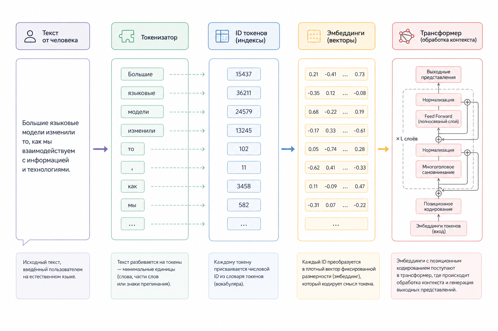

# 1.3.1 Tokens и tokenization

### Как LLM видит текст

LLM не "видит" текст так, как его видит человек.

Для модели текст – это последовательность токенов.

Токен – это не слово. Иногда это слово, иногда часть слова, иногда символ.

Например:

```
"understanding"
```

может быть разбито как:

```
["under", "stand", "ing"]
```

А фраза:

```
"How are you?"
```

может превратиться в:

```
[2437, 527, 499, 30]
```

где числа – это token IDs.

### Почему tokenization вообще нужен

Нейросеть работает с числами, а не с текстом.

Поэтому pipeline выглядит так:

```
Text
 ↓
Tokenizer
 ↓
Token IDs
 ↓
Embeddings
 ↓
Transformer layers
 ↓
Probabilities
 ↓
New token
```

### Почему токены важны для бэкенд-разработчика

Практически всё в LLM считается через токены:

* стоимость API
* задержка (latency)
* ограничения контекста
* использование памяти
* throughput
* batching
* кэширование

Например:

| Модель  | Context Window |
| ------- | -------------- |
| GPT-3.5 | \~16K tokens   |
| GPT-4o  | 128K+          |
| Claude  | 200K+          |

Большой JSON, SQL schema или огромный лог-файл могут "съесть" контекст быстрее, чем ожидает разработчик.

### Пример подсчета токенов на PHP

```php
$text = file_get_contents('document.txt');

$tokens = 0;

$token = strtok($text, " \t\n\r\0\x0B");

while ($token !== false) {
    $tokens++;
    $token = strtok(" \t\n\r\0\x0B");
}

echo "Примерное количество токенов: " . $tokens;

// Результат:
// Примерное количество токенов: ...
```

Это очень грубая оценка, но для бэкенд-разработки часто достаточно помнить правило:&#x20;

> 1 token ≈ 3–4 символа английского текста

Для русского языка токенов обычно больше.

### Визуализация токенизации

На изображении ниже приводится схематический процесс конвейера токенизации.

<figure><figcaption><p>Рис. 1.3.1 Конвейер токенизации</p></figcaption></figure>
