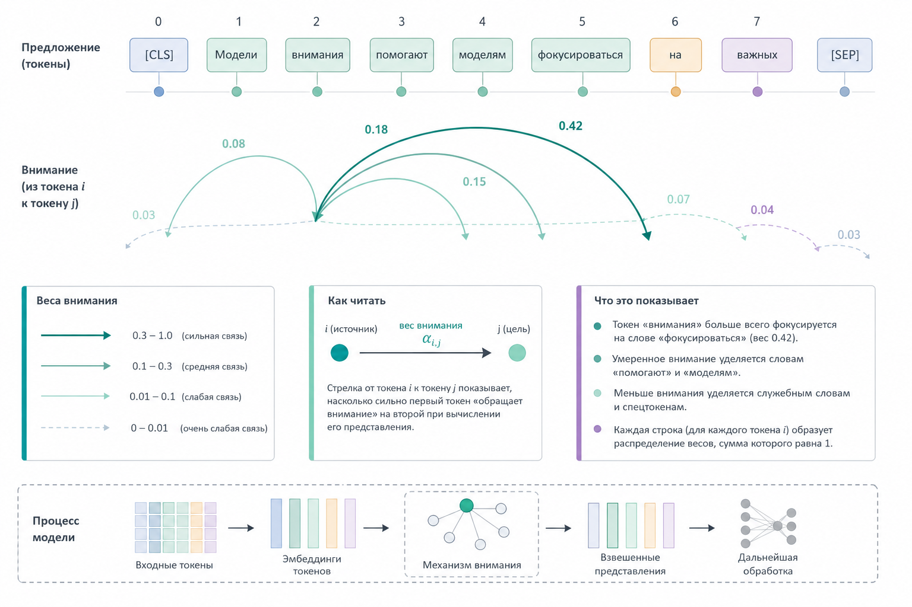

# 1.3.3 Attention – интуитивно

Внимание (аttention) – это механизм, который позволяет модели понимать: на какие части текста нужно смотреть сильнее.

Когда человек читает:

```
"PHP developer fixed the bug because he understood the architecture."
```

человек автоматически понимает, что "he" относится к developer.

Трансформер (transformer) делает примерно то же самое через математические веса внимания.

### Показатель внимания - Attention score

Упрощённо attention можно представить как:

$$
Attention(Q,K,V)=softmax\left(\frac{QK^T}{\sqrt{d_k}}\right)V
$$

Это выглядит страшно, но идея очень простая:

* Query – что мы ищем
* Key – где искать
* Value – что извлекать

### Интуитивная аналогия

Представьте, что вы работаете в IDE.

Когда вы пишете:

```php
$user->
```

IDE начинает искать:

* методы
* свойства
* типы
* контекст

После этого IDE показывает подходящие подсказки.

Attention работает похожим образом, только внутри нейросети. Модель постоянно анализирует связи между словами и пытается понять, какие части текста наиболее важны в текущем контексте.

### Почему трансформеры изменили разработку ПО

До появления трансформеров системы NLP были сильно ограничены. Они плохо понимали длинный контекст, слабо работали со сложными зависимостями в тексте и генерировали довольно примитивные результаты.

Трансформерная архитектура изменила ситуацию. Она позволила:

* эффективно распараллеливать вычисления
* обучать модели на огромных объёмах данных
* использовать данные практически всего интернета
* значительно улучшить качество генерации текста

После этого разработка программного обеспечения начала быстро меняться.

### Что изменилось практически

LLM впервые сделали возможными многие вещи, которые раньше считались слишком сложными:

* генерацию кода, похожего на production-код
* работу с документацией
* автоматизацию шаблонного программирования
* создание AI-помощников
* разработку AI-агентов

По сути, трансформеры стали новым уровнем исполнения внутри современной программной экосистемы.

### Визуализация attention

<figure><figcaption><p>Рис. 1.3.3 Механизм внимания трансформера</p></figcaption></figure>

На приведённой схеме вы можете видеть, как разные слова в предложении связываются друг с другом через веса внимания. Чем важнее связь между словами, тем сильнее механизм attention обращает на неё внимание.
