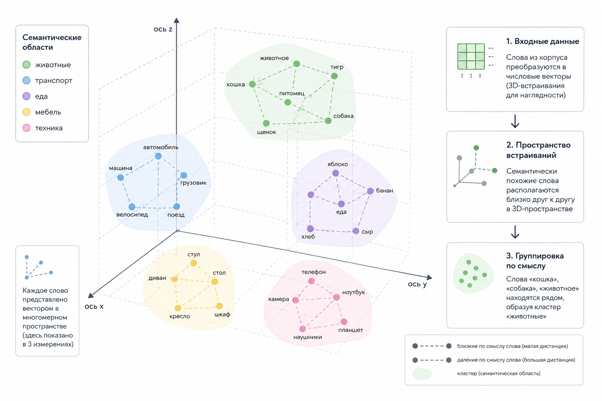

# 1.3.6 Эмбеддинги

Эмбеддинги ([embeddings](../../vvedenie/glossarii.md#embeddings)) – это способ представить смысл текста в виде набора чисел.

Когда модель получает текст, она преобразует его в вектор – массив чисел, который отражает смысл слова, фразы или документа.

Например:

```
"cat" → [0.12, -0.91, 0.44, ...]
```

Тексты с похожим смыслом получают похожие эмбеддинги и оказываются рядом друг с другом в многомерном пространстве.

## Почему эмбеддинги стали важны

Именно эмбеддинги сделали возможным появление многих современных AI-систем.

На них построены:

* Семантический поиск
* Системы RAG
* Векторные базы данных
* Системы рекомендаций
* Системы памяти
* Конвейеры поиска

Благодаря эмбеддингам система может искать не просто одинаковые слова, а похожий смысл.

Например, запрос:

```
"cheap laptop"
```

может находить документы с текстом:

```
"budget notebook"
```

даже если слова не совпадают напрямую.

## Косинусное сходство&#x20;

Чтобы понять, насколько embeddings похожи друг на друга, обычно используют косинусное сходство ([cosine similarity](../../vvedenie/glossarii.md#cosine-similarity)).

$$
\cos(\theta)=\frac{A\cdot B}{|A||B|}
$$

Если значение cosine similarity близко к 1, значит векторы очень похожи по смыслу.

## Пример на PHP

Даже базовый расчёт similarity можно реализовать обычным PHP-кодом:

```php
function cosineSimilarity(array $a, array $b): float
{
    $dot = 0;
    $normA = 0;
    $normB = 0;

    for ($i = 0; $i < count($a); $i++) {
        $dot += $a[$i] * $b[$i];
        $normA += $a[$i] ** 2;
        $normB += $b[$i] ** 2;
    }

    return $dot / (sqrt($normA) * sqrt($normB));
}

$v1 = [0.1, 0.3, 0.7];
$v2 = [0.2, 0.4, 0.6];

echo cosineSimilarity($v1, $v2);
```

Этот код вычисляет, насколько два эмбеддинг-вектора похожи друг на друга.

## Пространство эмбеддингов&#x20;

<figure><figcaption><p>Рис. 1.3.6. Визуализация пространства эмбеддингов</p></figcaption></figure>

Если визуализировать эмбеддинги, получится пространство (иногда его ещё называют латентным пространством), где близкие по смыслу слова располагаются рядом.

Например:

```
cat
dog
animal
```

будут находиться близко друг к другу, потому что имеют похожий смысл.

А слова с другим контекстом окажутся дальше в embeddings space.

```
            animal
           /     \
        cat      dog


                 car
```

Именно так работают vector databases и semantic search в современных AI-системах.
