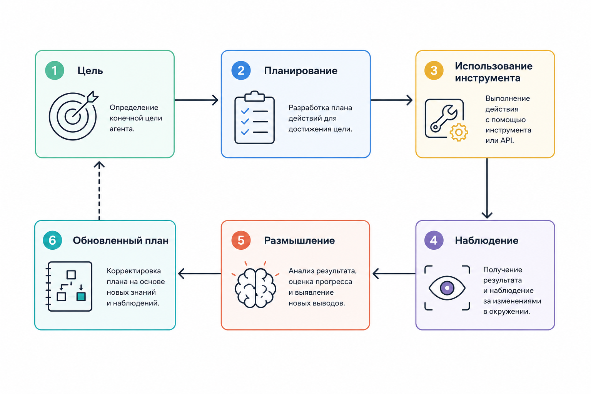

# 1.4.1 Что такое AI-агент

### Как устроен AI-агент

Сегодня термин "AI-агент" используют слишком широко, из-за чего возникает путаница. Агентом могут назвать обычного чат-бота, workflow с LLM, автономную систему, слой оркестрации или даже целую мульти-агентную платформу. Но с инженерной точки зрения AI-агент – это не просто модель, а система, которая умеет получать цель, принимать решения, выполнять действия, анализировать результат и менять своё поведение в зависимости от ситуации.

По сути, агент работает как непрерывный цикл: сначала он получает цель, затем строит план, выполняет определённые действия, наблюдает результат и после этого корректирует дальнейшие шаги. Этот процесс можно описать как цепочку:&#x20;

```
Goal → Plan → Act → Observe → Adjust
```

То есть система постоянно оценивает текущее состояние и принимает новое решение на основе полученного результата.


<figure><figcaption><p>Рис. 1.4.1 Архитектурная схема цикла работы AI-агента</p></figcaption></figure>

Важно понимать, что сам LLM не является агентом. LLM – это лишь компонент рассуждения внутри агентной архитектуры. Настоящий AI-агент обычно включает в себя память, инструменты, оркестрация, механизм выполнения, сохранение состояния, повторные попытки механизмов и логика планирования. Именно сочетание всех этих компонентов делает систему способной действовать автономно.

### Математическая интуиция агента

Если говорить совсем упрощённо, агента можно представить как функцию, которая принимает решение на основе текущего состояния системы, наблюдений, памяти и поставленной цели:

$$
at+1=f(st,ot,mt,gt)a_{t+1}=f(s_t,o_t,m_t,g_t)at+1​=f(st​,ot​,mt​,gt​)
$$

Здесь:

* $$s_t$$​ – текущее состояние системы
* $$o_t$$​ – observation
* $$m_t$$​ – memory
* $$g_t$$​ – goal
* $$a_{t+1}$$ – следующее действие

То есть агент постоянно анализирует ситуацию и определяет, что делать дальше.
