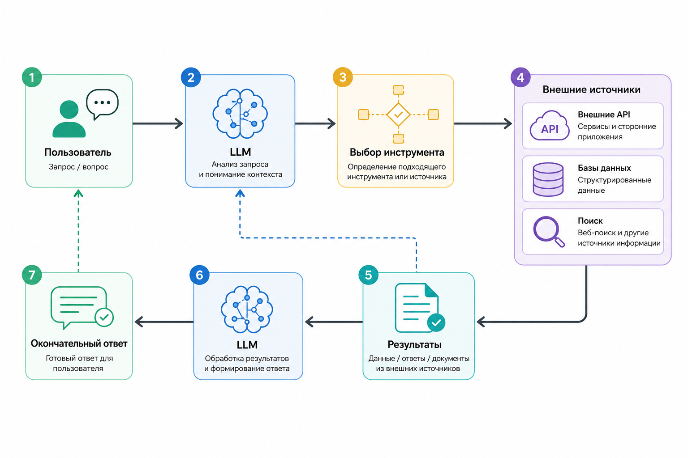

# 1.4.3 Tool calling архитектура

Современные LLM редко работают изолированно.

Настоящая сила AI-систем появляется тогда, когда модель получает возможность использовать внешние инструменты: API, базы данных, поисковые системы, внутренние сервисы и другие компоненты инфраструктуры.

Такой подход называется **tool calling** (вызов инструмента).

### Базовая идея

Важно понимать главный принцип: LLM не выполняет действия напрямую.

Модель лишь генерирует структурированное намерение (structured intent), которое описывает, какой инструмент нужно вызвать и с какими параметрами.

Например:

```json
{
  "tool": "search_web",
  "arguments": {
    "query": "latest NVIDIA earnings"
  }
}
```

После этого оркестратор или бэкэнд-система получает структурированный вывод и уже самостоятельно представляет нужный инструмент.

Именно бэкэнд отвечает за уровень исполнения, а не сама модель.

### Архитектура tool calling

Типичная архитектура выглядит так:

```
User
 ↓
LLM
 ↓
Tool Selector
 ↓
External APIs / Database / Search
 ↓
Results
 ↓
LLM
 ↓
Final Response
```

В такой схеме LLM становится reasoning-компонентом, а вся работа с внешними системами выполняется через детерминированный уровень оркестрации.

<figure><figcaption><p>Рис. 1.4.3 Архитектура вызова инструментов</p></figcaption></figure>

### Типичный поток выполнения

Для большинства AI-систем в production-среде процесс выглядит примерно одинаково:

1. Пользователь отправляет сообщение
2. LLM определяет, нужен ли tool
3. Backend валидирует аргументы
4. Выполняется вызов инструмента
5. Результат нормализуется
6. Данные возвращаются обратно в LLM
7. Модель формирует финальный ответ

Это позволяет отделить рассуждение от исполнения и сделать систему безопаснее и надёжнее.

### Почему оркестрацию нельзя доверять модели

LLM остаётся вероятностной системой.

Это означает, что модель может ошибаться даже при работе с инструментами.

Например, она может:

* сгалюционировать название инструмента
* генерировать невалидный JSON
* перепутать схемы
* вызывать неправильный инструмент

Именно поэтому оркестрация почти всегда строится как детерминированный слой с жёсткими правилами, валидацией и контролем схем.

### Пример tool calling на PHP

Ниже простой пример, где бэкенд получает структурированный вывод от модели и безопасно вызывает нужный инструмент:

```php
$response = [
    "tool" => "weather_api",
    "arguments" => [
        "city" => "Jerusalem"
    ]
];

if ($response["tool"] === "weather_api") {
    $city = $response["arguments"]["city"];

    $weather = getWeather($city);

    echo json_encode([
        "result" => $weather
    ]);
}

function getWeather(string $city): array
{
    return [
        "temperature" => 28,
        "condition" => "Sunny"
    ];
}
```

В этом примере модель не вызывает API напрямую. Она только сообщает, какой инструмент нужно использовать и какие аргументы передать. Всё остальное контролирует бэкенд.

### Структурированные выходные данные

Практически все современные AI systems используют структурированные выходные данные вместо обычного текста.

Обычно для этого применяются:

* схема JSON
* вызов функций
* типизированные выходные данные
* уровни проверки

Причина проста: текст в свободной форме плохо подходит для оркестрации и автоматического потока выполнения.

Структурированные выходные данные позволяют сделать взаимодействие между LLM и бэкенд-инфраструктурой предсказуемым, безопасным и удобным для инженерии production-систем.
