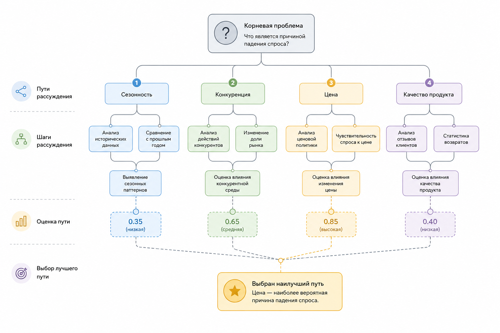

# 1.4.4 Planning и execution

Планирование – одна из самых переоценённых и одновременно самых важных тем в системах искусственного интеллекта.

Когда говорят: "агент умеет планировать", обычно имеют в виду:

* разбиение задачи на части
* построение последовательности шагов
* анализ зависимостей между шагами
* выполнение плана с возможностью изменений по ходу работы

### Простейший планировщик

Допустим, пользователь говорит:

> "Проанализируй конкурентов моего SaaS-сервиса".

Тогда система может разбить задачу на несколько этапов:

1. Найти конкурентов
2. Собрать информацию о ценах
3. Выделить ключевые функции
4. Сравнить решения между собой
5. Подготовить итоговое резюме

### Tree of Thoughts

Некоторые системы строят сразу несколько вариантов рассуждений.

Идея похожа на поиск пути в дереве решений (Дерево мыслей, ToT): система рассматривает разные направления, оценивает их и выбирает наиболее удачный вариант.

<figure><figcaption>
Рис. 1.4.4. Древо мыслей (ToT)
</figcaption></figure>

### Механизм выполнения

Сам по себе планировщик бесполезен. Нужен механизм выполнения, который отвечает за работу всего процесса.

Он управляет:

* повторными попытками при ошибках
* хранением состояния
* ограничением по времени
* очередностью задач
* отменой операций
* графом зависимостей между шагами

### Почему планирование – сложная задача

Каждый новый шаг увеличивает вероятность ошибки.

Если вероятность успешного выполнения одного шага:

$$
p = 0.95
$$

то вероятность успешного выполнения 20 последовательных шагов:

$$
P = 0.95^{20}
$$

что примерно равно 0.36.

Это фундаментальная проблема автономных систем. Чем длиннее цепочка рассуждений, тем выше вероятность накопления ошибок.
