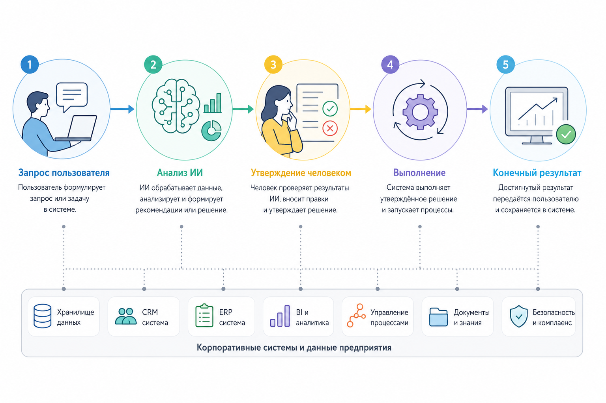

# 1.4.8 Human-in-the-loop systems

Полностью самостоятельные системы искусственного интеллекта пока остаются слишком ненадёжными.

Поэтому во многих рабочих системах в процесс обязательно включают человека.

### **Подтверждение человеком**

Например, искусственный интеллект может предложить действие:

* отправить письмо
* изменить договор
* провести оплату

Но окончательное решение и подтверждение всё равно принимает человек.

### **Архитектура HITL**

<figure><figcaption>
Рис. 1.4.4. Диаграмма HITL (Human-in-the-loop)
</figcaption></figure>

### **Почему HITL важен**

Такой подход значительно снижает:

* количество ошибок и вымышленных ответов ИИ
* юридические риски
* риски безопасности
* вероятность критических сбоев
