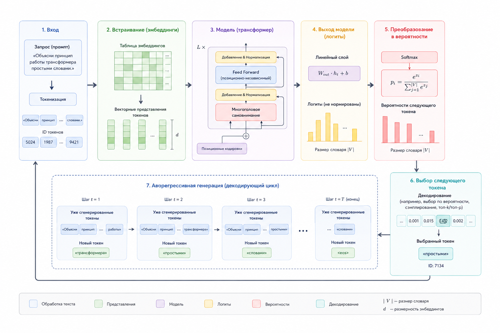

# 2.1.1 Что происходит между PHP и LLM

С точки зрения PHP интеграция с LLM выглядит довольно просто:

```
PHP → HTTP request → LLM → response
```

Backend отправляет HTTP-запрос к модели и получает ответ.&#x20;

Но внутри самой LLM происходит совершенно другой тип вычислений, который сильно отличается от привычной бэкенд-логики.

### Как на самом деле работает LLM

Мы уже говорили о том, что LLM не "думает" как человек и не хранит готовые ответы.

Во время инференса модель постоянно вычисляет вероятность следующего токена на основе предыдущего контекста.

Это можно описать формулой:

$$
P(token_n \mid token_1, \ldots, token_{n-1})
$$

То есть модель анализирует все предыдущие токены и пытается предсказать, какой токен наиболее вероятен следующим.

### Как происходит генерация ответа

Упрощённо процесс выглядит так:

```
"Explain transformers"
→ ["in", "simply", "like", "this"]
```

Модель формирует распределение вероятностей между возможными продолжениями и затем выбирает следующий токен.

После этого процесс повторяется снова и снова, пока не будет сформирован полный ответ.

Именно поэтому ответы LLM носят вероятностный, а не детерминированный характер.

### Внутренний pipeline LLM

Внутренний конвейер вывода выглядит примерно так:

```
Input
 ↓
Tokenization
 ↓
Embeddings
 ↓
Transformer Layers
 ↓
Attention
 ↓
Sampling
 ↓
Output
```

Сначала текст разбивается на токены. Затем токены преобразуются в эмбеддинги – числовые векторы, которые модель может обрабатывать.

После этого данные передаются через уровни трансформера и attention-механизмы, где модель анализирует связи между токенами и контекстом.

На финальном этапе применяется сэмплинг, который выбирает следующий токен из вероятностного распределения.

<figure><figcaption><p>2.1.1. Конвейер вывода LLM</p></figcaption></figure>

### Почему это важно для бэкенд-разработчика

Понимание внутренней природы LLM критически важно при построении AI-систем в production-среде.

Из-за вероятностного вывода возникают особенности, которые непривычны для классической серверной инженерии:

* ответы не детерминированы
* latency может быть нестабильным
* модель может нарушать формат ответа
* результат зависит от параметров выборки

Поэтому при работе с серверной системой LLM следует учитывать логику повторных попыток, проверку, структурированные выходные данные и уровень детерминированной оркестровки.
