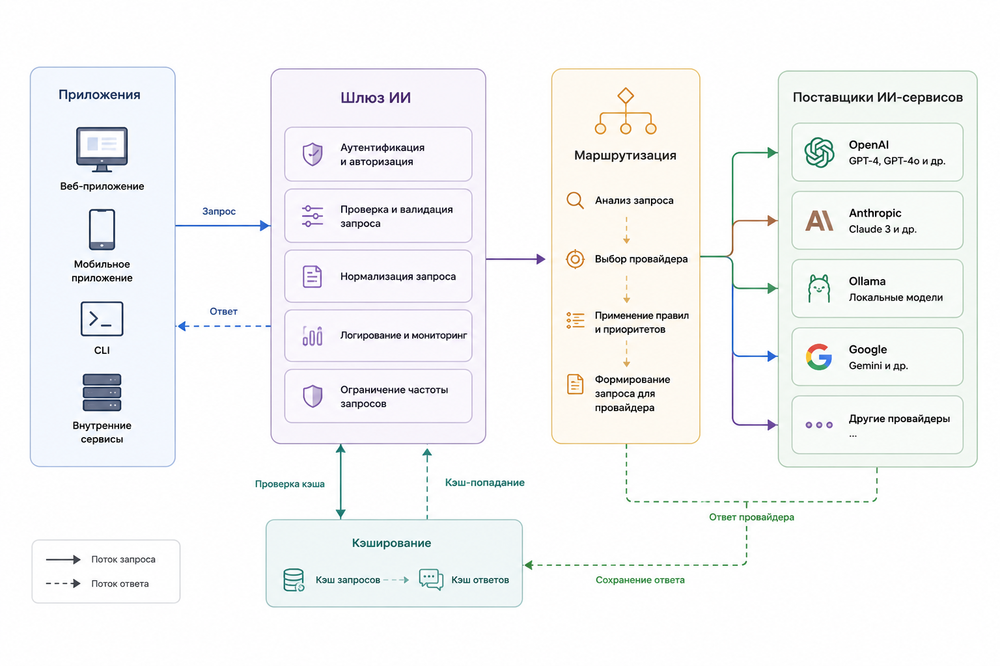

# 2.1.13 Универсальная архитектура AI клиента

#### Универсальная архитектура работы с ИИ

```
Приложение → Шлюз ИИ → Маршрутизация запросов → Поставщики ИИ-сервисов
```

<figure><figcaption><p>Рис. 2.1.13. Архитектура AI-шлюза</p></figcaption></figure>

**Архитектура на Laravel**

* **AIService** — единая точка доступа к функциям ИИ
* **ProviderManager** — управление подключёнными ИИ-сервисами
* **OpenAIProvider** — интеграция с OpenAI
* **AnthropicProvider** — интеграция с Anthropic
* **OllamaProvider** — интеграция с Ollama
* **Router** — выбор подходящего ИИ-сервиса для обработки запроса
* **Cache Layer** — слой кэширования для хранения и повторного использования результатов

В этой архитектуре все обращения к моделям искусственного интеллекта проходят через единый шлюз. Он определяет, какой сервис лучше подходит для выполнения конкретного запроса, и направляет его соответствующему поставщику. Управление подключёнными сервисами осуществляется через специальный менеджер, а слой кэширования позволяет сократить количество повторных запросов и повысить производительность системы.
