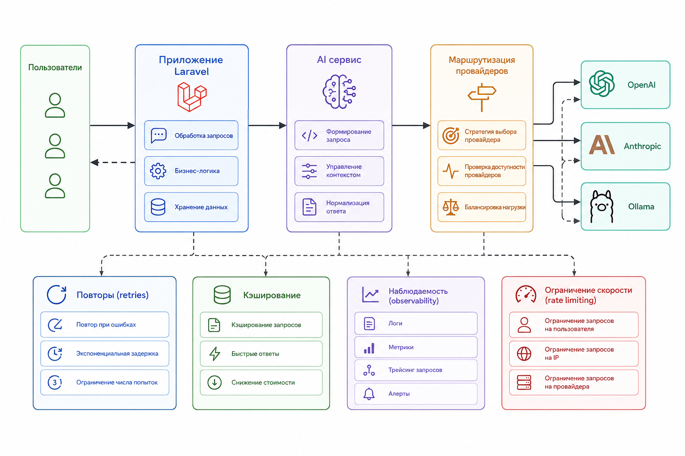

# 2.1.17 Сквозной проект: Production AI Client

### Предыдущие главы

* [1.2.9 Сквозной проект книги](../../chast-i.-foundations/1.2-novaya-epokha-bekend-razrabotki/1.2.9-skvoznoi-proekt-knigi.md)


В рамках главы 2.1 мы начнём с самого важного компонента – production-ready AI client.

### Цель текущей главы

В этой главе мы не строим полноценного AI-агента.

Наша задача намного фундаментальнее: построить production-ready AI client, через который вся платформа будет работать с LLM.

Именно этот слой позже станет:

* AI Gateway
* inference layer
* foundation для AI-агентов
* orchestration layer

### Архитектура проекта на текущем этапе

Пока система выглядит так:

```
Users
   ↓
Laravel Application
   ↓
AI Service
   ↓
Provider Routing
 ↓        ↓        ↓
OpenAI  Anthropic  Ollama
```

<figure><figcaption><p>Рис. 2.1.13. Первоначальная архитектура AI-шлюза </p></figcaption></figure>

### Бизнес-проблема

Команда начала с простого OpenAI integration:

```php
$response = Http::withToken($apiKey)
    ->post($url, [
        'model' => 'gpt-4.1-mini',
        'messages' => [...]
    ]);
```

В dev-среде всё работало отлично.

Но после выхода в продакшен появились проблемы:

* периодические тайм-ауты
* сбои в работе провайдера
* rate limiting;
* нестабильный JSON
* рост стоимости инференса
* зависающие queue workers
* непредсказуемые задержки
* и т.д.

Очень быстро стало понятно:

> LLM integration нельзя строить как обычный API helper.

### Шаг 1. Unified AI interface

Тогда команда решила спрятать всех AI-провайдеров за единым интерфейсом.

#### AIProvider interface

```php
namespace App\AI\Contracts;

use App\AI\DTO\AIRequest;
use App\AI\DTO\AIResponse;

interface AIProvider
{
    public function generate(AIRequest $request): AIResponse;
}
```

#### AIRequest

```php
namespace App\AI\DTO;

final readonly class AIRequest
{
    public function __construct(
        public string $prompt,
        public string $model,
        public float $temperature = 0.2,
        public bool $stream = false,
    ) {
    }
}
```

#### AIResponse

```php
namespace App\AI\DTO;

final readonly class AIResponse
{
    public function __construct(
        public string $text,
        public int $inputTokens,
        public int $outputTokens,
        public float $latencyMs,
        public string $provider,
    ) {
    }
}
```

#### Почему уровень абстракции критически важен

Без него код быстро превращается в:

```php
if ($provider === 'openai') {}

if ($provider === 'anthropic') {}

if ($provider === 'ollama') {}
```

Через несколько месяцев такой код становится практически неподдерживаемым.

### Шаг 2. OpenAI Provider

#### Реализация

Для начала реализуем наш первый провайдер - `OpenAIProvider`.

<details>

<summary><strong>Class OpenAIProvider</strong></summary>

```php
namespace App\AI\Providers;

use App\AI\Contracts\AIProvider;
use App\AI\DTO\AIRequest;
use App\AI\DTO\AIResponse;
use App\AI\Exceptions\AIProviderException;
use Illuminate\Http\Client\ConnectionException;
use Illuminate\Http\Client\RequestException;
use Illuminate\Support\Facades\Http;

class OpenAIProvider implements AIProvider
{
    public function generate(AIRequest $request): AIResponse {
        $startedAt = microtime(true);

        try {
            // Make request
            $response = Http::withToken((string) config('services.openai.key'))
                ->timeout((int) config('ai.timeout_seconds', 30))
                ->connectTimeout((int) config('ai.connect_timeout_seconds', 5))
                ->post('https://api.openai.com/v1/chat/completions', [
                    'model' => $request->model,
                    'temperature' => $request->temperature,
                    'stream' => $request->stream,
                    'messages' => [
                        [
                            'role' => 'user',
                            'content' => $request->prompt,
                        ],
                    ],
                ])
                ->throw();
        } catch (ConnectionException | RequestException $exception) {
            throw new AIProviderException(
                sprintf('AI provider request failed for provider "openai": %s', $exception->getMessage()),
                previous: $exception,
            );
        }

        // Validate response
        /** @var mixed $data */
        $data = $response->json();
        if (! is_array($data)) {
            throw new AIProviderException('Invalid OpenAI response payload: expected JSON object.');
        }

        // Get response text
        $text = $data['choices'][0]['message']['content'] ?? null;
        $promptTokens = $data['usage']['prompt_tokens'] ?? null;
        $completionTokens = $data['usage']['completion_tokens'] ?? null;

        if (! is_string($text) || ! is_int($promptTokens) || ! is_int($completionTokens)) {
            throw new AIProviderException('Invalid OpenAI response payload: missing required fields.');
        }

        return new AIResponse(
            text: $text,
            inputTokens: $promptTokens,
            outputTokens: $completionTokens,
            latencyMs: (microtime(true) - $startedAt) * 1000,
            provider: 'openai',
        );
    }
}
```


</details>

#### Что неожиданно ломается в production

Почти сразу команда столкнулась с:

* broken JSON
* rate limits
* нестабильной latency
* 500 errors
* timeout spikes

Причина в том, что LLM – вероятностная система.

Модель вычисляет вероятность следующего токена:

$$
P(token_n | token_1, ..., token_{n-1})
$$

Даже JSON для модели – это просто последовательность токенов.

### Шаг 3. Structured output

Для платформы поддержки клиентов простой текст (plain text) был бесполезен.

Системе нужен строгий JSON:

```json
{
  "summary": "Client cannot login",
  "sentiment": "negative",
  "urgency": "high"
}
```

#### Validation layer

Для этого придётся добавить сервис `DraftReplyService`:

<details>

<summary><strong>Class DraftReplyService</strong></summary>

```php
namespace App\Services\Support;

use App\AI\Contracts\AIProvider;
use App\AI\DTO\AIRequest;
use App\AI\Exceptions\InvalidAIResponseException;
use JsonException;

/**
 * Generates structured AI analysis for support messages and validates
 * strict JSON output before returning normalized fields.
 */
class DraftReplyService
{
    public function __construct(private readonly AIProvider $aiProvider)
    {
    }

    /**
     * @return array{summary: string, sentiment: string, urgency: string}
     */
    public function draftReply(string $customerMessage, string $ticketContext = ''): array
    {
        $response = $this->aiProvider->generate(new AIRequest(
            prompt: $this->buildPrompt($customerMessage, $ticketContext),
            model: (string) config('ai.default_model', 'gpt-4o-mini'),
            temperature: 0.2,
        ));

        return $this->parseStructuredResponse($response->text);
    }

    private function buildPrompt(string $customerMessage, string $ticketContext): string
    {
        $context = trim($ticketContext);
        $contextPart = $context !== ''
            ? "\nКонтекст тикета:\n{$context}\n"
            : '';

        return <<<PROMPT
You are a customer support assistant.
Analyze the customer message and return strict JSON with this exact shape:
{"summary":"...","sentiment":"positive|neutral|negative","urgency":"low|medium|high"}
Return only valid JSON without markdown, comments, or extra keys.

Customer message:
{$customerMessage}
{$contextPart}
PROMPT;
    }

    /**
     * @return array{summary: string, sentiment: string, urgency: string}
     */
    private function parseStructuredResponse(string $responseText): array
    {
        try {
            /** @var mixed $data */
            $data = json_decode($responseText, true, flags: JSON_THROW_ON_ERROR);
        } catch (JsonException) {
            throw new InvalidAIResponseException('Invalid AI response payload: response is not valid JSON.');
        }

        if (
            ! is_array($data)
            || ! isset($data['summary'])
            || ! isset($data['sentiment'])
            || ! isset($data['urgency'])
            || ! is_string($data['summary'])
            || ! is_string($data['sentiment'])
            || ! is_string($data['urgency'])
        ) {
            throw new InvalidAIResponseException();
        }

        $summary = trim($data['summary']);
        $sentiment = strtolower(trim($data['sentiment']));
        $urgency = strtolower(trim($data['urgency']));

        if (
            $summary === ''
            || ! in_array($sentiment, ['positive', 'neutral', 'negative'], true)
            || ! in_array($urgency, ['low', 'medium', 'high'], true)
        ) {
            throw new InvalidAIResponseException('Invalid AI response payload: JSON values are outside allowed ranges.');
        }

        return [
            'summary' => $summary,
            'sentiment' => $sentiment,
            'urgency' => $urgency,
        ];
    }
}
```


</details>

и специальное исключение `InvalidAIResponseException`.

```php
namespace App\AI\Exceptions;

/**
 * Thrown when the AI model response cannot be validated as strict
 * structured support JSON (summary, sentiment, urgency).
 */
class InvalidAIResponseException extends AIProviderException
{
    public function __construct(string $message = 'Invalid AI response payload: expected structured JSON fields.') {
        parent::__construct($message);
    }
}
```


\>>>>>>>>>>>>>>>>>>>>>>>>>

### Шаг 4. Retries и exponential backoff

В production периодически появлялись:

* 429;
* network failures;
* provider overload.

Команда внедрила retries.

***

#### Формула backoff

delay = base \times 2^n

delay = base \times 2^n

***

#### Laravel implementation

```php
function retryWithBackoff(
    callable $fn,
    int $maxRetries = 5
) {

    $attempt = 0;

    while ($attempt < $maxRetries) {

        try {

            return $fn();

        } catch (Throwable $e) {

            sleep(pow(2, $attempt));

            $attempt++;
        }
    }

    throw new RuntimeException(
        'Max retries exceeded'
    );
}
```

***

### Шаг 5. Failover между моделями

Компания не хотела зависеть только от OpenAI.

Появилась multi-provider architecture.

***

#### Routing

```
Primary  → GPT-4.1
Fallback → Claude Sonnet
Fallback → Local Llama
```

***

#### Failover service

```php
class FailoverAIService
{
    public function generate(
        AIRequest $request
    ): AIResponse {

        foreach ($this->providers as $provider) {

            try {

                return $provider->generate($request);

            } catch (Throwable $e) {

                Log::warning('Provider failed', [
                    'provider' => get_class($provider),
                    'error' => $e->getMessage(),
                ]);
            }
        }

        throw new RuntimeException(
            'All providers failed'
        );
    }
}
```

***

### Шаг 6. Streaming responses

Пользователи жаловались на долгую генерацию.

Средний response time был:

T = T\_{prompt} + N \cdot T\_{token}

T = T\_{prompt} + N \cdot T\_{token}

При длинных ответах latency доходил до 15–20 секунд.

***

#### Решение

Команда внедрила streaming responses.

Теперь интерфейс показывал:

```
Analyzing ticket...
Generating summary...
Generating suggested reply...
```

Perceived latency значительно снизился.

***

### Шаг 7. Rate limiting

После роста нагрузки появились массовые 429 ошибки.

AI API ограничивали:

* requests per minute;
* tokens per minute.

***

#### Laravel RateLimiter

```php
RateLimiter::for('ai', function () {

    return Limit::perMinute(100);
});
```

***

### Шаг 8. Observability

Без observability AI-система стала практически непрозрачной.

Команда начала собирать:

* latency;
* token usage;
* provider failures;
* retries;
* timeout frequency;
* cost.

***

#### Logging

```php
Log::info('AI request', [
    'provider' => $provider,
    'latency' => $latency,
    'tokens' => $tokens,
]);
```

***

### Шаг 9. Кэширование

Многие support tickets повторялись.

Например:

* проблемы логина;
* password reset;
* billing questions.

***

#### Cache layer

```php
$key = md5($prompt);

return Cache::remember(
    $key,
    3600,
    fn() => $provider->generate($request)
);
```

***

### Финальная архитектура главы 2.1

К концу главы система выглядела так:

```
Users
   ↓
Laravel Application
   ↓
AI Gateway
   ↓
Routing Layer
   ↓
Retry Layer
   ↓
Provider Adapters
 ↓        ↓        ↓
GPT    Claude   Ollama
```

***

#### Что появится в следующих главах

Этот AI client станет foundation для следующих частей книги.

Позже мы добавим:

* AI agents;
* tool calling;
* memory layer;
* embeddings;
* vector database;
* orchestration engine;
* agent workflows;
* realtime observability;
* distributed inference.

***

### Результаты проекта

После внедрения production AI layer:

| Метрика             | До       | После           |
| ------------------- | -------- | --------------- |
| AI failures         | 8%       | <0.5%           |
| Средний latency     | 12s      | 3.5s            |
| Timeout errors      | Часто    | Редко           |
| Provider outages    | Критично | Почти незаметно |
| Стоимость inference | 100%     | 62%             |

***

### Главный вывод главы

Самое важное изменение мышления:

LLM integration – это не API helper, а полноценный инфраструктурный слой платформы.

Именно поэтому production AI systems всё больше напоминают:

* distributed systems;
* API gateways;
* orchestration platforms;
* inference infrastructure.
