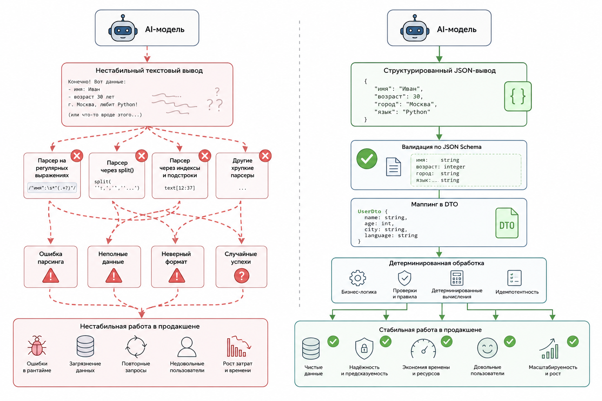

# 2.2.1 Почему plain-text output ломает production

### Почему текстовый ответ модели может привести к сбоям

Когда разработчики впервые подключают языковую модель к PHP-приложению, они обычно начинают с самого простого варианта:

```php
$response = $client->chat([
    'model' => 'gpt-4.1',
    'messages' => [
        ['role' => 'user', 'content' => 'Определи настроение письма']
    ]
]);

echo $response['content'];
```

Модель может вернуть такой ответ:

> Письмо выглядит раздражённым. Пользователь недоволен задержкой доставки.

На этапе создания прототипа такой подход кажется удобным и вполне рабочим. Однако в реальных системах проблемы возникают очень быстро.

Главная сложность заключается в том, что обычный текстовый ответ (plain-text output) не является стабильным интерфейсом обмена данными. Модель может передать одну и ту же информацию разными способами.

Сегодня ответ будет таким:

```
negative
```

Завтра:

```
The sentiment is negative.
```

Через несколько дней:

```
This looks slightly negative but not extremely aggressive.
```

А после очередного обновления модели:

```
Customer sentiment: NEGATIVE
Urgency: MEDIUM
```

Для человека все эти варианты означают примерно одно и то же. Но для программы это совершенно разные структуры данных.

<figure><figcaption><p>Рис. 2.2.1. Простой текст против структурированного вывода</p></figcaption></figure>

Языковая модель работает как вероятностная система. Она не выполняет заранее заданный алгоритм и не возвращает строго фиксированный результат. Вместо этого модель генерирует наиболее вероятное продолжение текста на основе полученного запроса.

Если приложение не имеет чётко определённого формата ответа, любое изменение поведения модели может привести к ошибкам.

В результате могут перестать корректно работать:

* обработка ответов модели
* маршрутизация запросов внутри системы
* бизнес-логика приложения
* сценарии работы искусственного интеллекта
* аналитика
* мониторинг и наблюдение за работой системы
* автоматизированные процессы

### Почему production-системы используют структурированный вывод

Именно поэтому в  production-системах редко используют произвольные текстовые ответы напрямую.

Современные решения на базе искусственного интеллекта обычно строятся вокруг структурированных данных (structured AI-output). Вместо свободного текста модель возвращает результат в заранее определённом формате, который приложение может надёжно обработать независимо от особенностей формулировки ответа.
