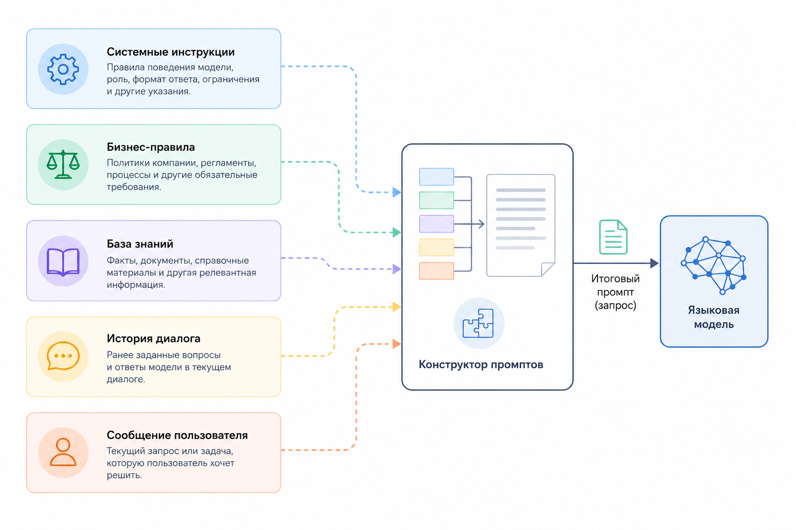

# 2.3.3 Динамическая сборка промптов

### Как собираются промпты

В реальных системах искусственного интеллекта редко используется один заранее подготовленный промпт. Гораздо чаще итоговый запрос формируется динамически из нескольких частей в зависимости от контекста, задачи и доступных данных.

Обычно в состав такого запроса входят различные информационные блоки:

* системные инструкции
* бизнес-правила
* данные из базы знаний
* история предыдущего общения
* текущее сообщение пользователя

В результате получается своеобразный конструктор, из которого для каждого запроса собирается новый промпт.

Например:

```
Системные инструкции
        +
Бизнес-правила
        +
База знаний
        +
История диалога
        +
Сообщение пользователя
```

Такой процесс можно описать следующей формулой:

$$
Prompt=S+B+K+H+U
$$

где:

* $$S$$ – системные инструкции
* $$B$$ – бизнес-правила
* $$K$$ – внешние знания и контекст
* $$H$$ – история диалога
* $$U$$ – текущее сообщение пользователя

Для наглядности:

<figure><figcaption><p>Рис. 2.3.3. Сборка промпта из отдельных блоков</p></figcaption></figure>

### **Пример реализации**

В программном коде динамическая сборка промпта может выглядеть следующим образом:

```php
$prompt =
    $systemPrompt .
    $businessRules .
    $knowledgeContext .
    $history .
    $userMessage;
```

На практике каждая из этих частей может формироваться отдельно и добавляться в запрос только при необходимости. Например, для нового пользователя история диалога может отсутствовать, а для специализированной задачи дополнительно подключаются сведения из базы знаний.

Именно такой подход используется в большинстве современных платформ искусственного интеллекта. Он позволяет адаптировать запрос под конкретную ситуацию, учитывать накопленный контекст и обеспечивать более точные и релевантные ответы модели.
